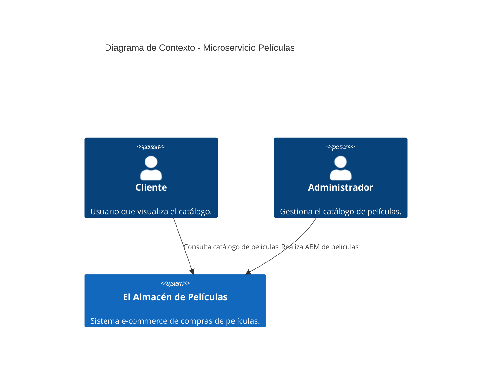
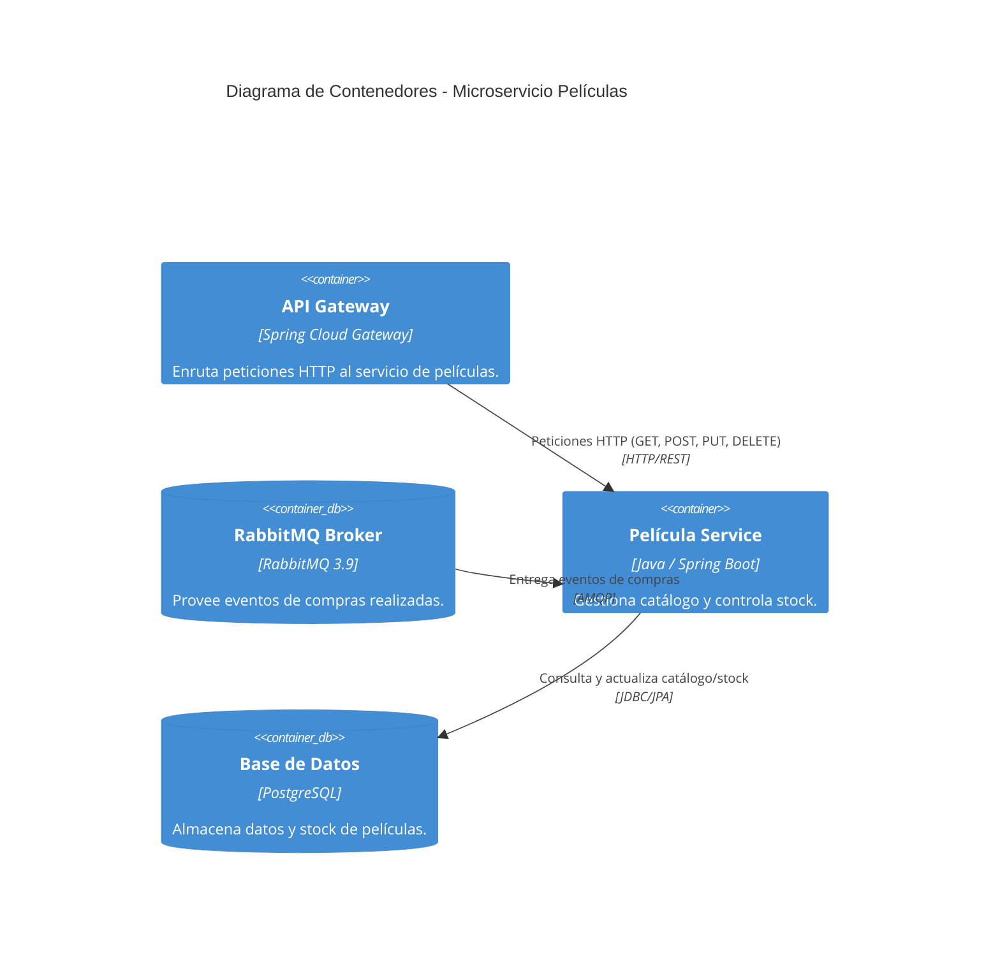

# Vertical Película - Microservicio Backend

Este microservicio forma parte del sistema **El Almacén de Películas Online** y se encarga de gestionar el catálogo de películas, permitiendo la administración (ABM), visualización por parte de los clientes y el control de stock de las películas disponibles.

---

## 1. Propósito y Visión General

El microservicio `pelicula-backend` da cumplimiento a los requerimientos del sistema:
- **RF-1 (Listado de catálogo)**: Permite visualizar el catálogo ordenado de más reciente a más antiguo, incluyendo detalles básicos.
- **RF-2 (Detalle de película)**: Proporciona la información ampliada de una película seleccionada.
- **RF-12 (ABM películas)**: Permite a un administrador agregar, modificar y gestionar las películas del catálogo.
- **RF-15 (Control de Stock)**: Garantiza que no se vendan películas sin disponibilidad.

### Funcionalidades Principales
1. **Gestión del Catálogo**: Endpoints CRUD para la administración integral de películas.
2. **Consultas de Clientes**: Endpoints optimizados para la visualización del listado de películas y su detalle ampliado.
3. **Control de Concurrencia de Stock**: Validaciones estrictas al momento de confirmar una compra para evitar sobreventa.
4. **Consumo de Eventos de Compra**: Escucha eventos asincrónicos para descontar el stock de manera definitiva.

---

## 2. Servicios Expuestos vía HTTP (API REST)

Base URL: `http://localhost:8081/api/peliculas`

| Método | Endpoint | Descripción | Estado HTTP |
| :--- | :--- | :--- | :--- |
| `GET` | `/api/peliculas` | Obtiene el listado del catálogo ordenado. | `200 OK` |
| `GET` | `/api/peliculas/{id}` | Obtiene el detalle ampliado de una película específica. | `200 OK` / `404 Not Found` |
| `POST` | `/api/peliculas` | (Admin) Crea una nueva película en el catálogo. | `201 Created` / `400 Bad Request` |
| `PUT` | `/api/peliculas/{id}` | (Admin) Modifica los datos de una película existente. | `200 OK` / `404 Not Found` |
| `DELETE` | `/api/peliculas/{id}` | (Admin) Elimina (o da de baja) una película del catálogo. | `204 No Content` / `404 Not Found` |

### Estructura de DTOs / Payloads

#### PeliculaDTO (`GET /api/peliculas/{id}`)
```json
{
  "id": 1,
  "titulo": "Inception",
  "directores": "Christopher Nolan",
  "actores": "Leonardo DiCaprio, Joseph Gordon-Levitt",
  "precio": 1500.00,
  "formato": "Digital",
  "genero": "Ciencia Ficción",
  "sinopsis": "Un ladrón que roba secretos corporativos...",
  "imagen": "url_imagen.jpg",
  "fechaSalida": "2010-07-16",
  "stock": 50,
  "condicion": "Nueva"
}
```

---

## 3. Eventos Publicados y Consumidos

### Modelo de Integración por Mensajería (RabbitMQ)

- **Exchange**: `compras.exchange` (TopicExchange)
- **Cola (Queue)**: `compras.pelicula.stock.queue`
- **Routing Key**: `compras.realizadas.routing-key`

```
 [ Microservicio Carrito / Compras ]
                 │
                 ▼  (Publica evento 'compras.realizadas.routing-key')
      ┌─────────────────────┐
      │  compras.exchange   │
      └──────────┬──────────┘
                 │
                 ▼
 ┌───────────────────────────────────┐
 │   compras.pelicula.stock.queue    │
 └───────────────┬───────────────────┘
                 │
                 ▼  (@RabbitListener)
     [ Microservicio Películas ]
                 │
                 ▼
      (Descuento de Stock en BD)
```

---

## 4. Arquitectura y Diagramas C4

### Diagrama Nivel 1: Contexto del Sistema



### Diagrama Nivel 2: Contenedores



---

## 5. Ejecución de Pruebas Automatizadas

El proyecto incluye pruebas automatizadas para garantizar la calidad del código, enfocadas especialmente en el ABM y el control estricto de concurrencia de stock.

Para ejecutar todas las pruebas automatizadas y verificar la cobertura:
```bash
./mvnw clean test
```

---

## 6. Despliegue y Ejecución Local (Guía de Volúmenes y Base de Datos)

Este apartado describe el procedimiento recomendado para crear correctamente los volúmenes de Docker y desplegar la base de datos usando **Docker Compose**.

### 6.1. Verificar los volúmenes existentes
Antes de crear nuevos volúmenes, revisa los existentes:
```bash
docker volume ls
```
Si hay volúmenes antiguos que ya no usas, puedes eliminarlos:
```bash
docker volume rm nombre_del_volumen
```
O eliminar todos los volúmenes no utilizados:
```bash
docker volume prune
```

### 6.2. Reconstruir las imágenes (si cambió el código o Dockerfile)
Siempre que cambies el Dockerfile o el código del proyecto:
```bash
docker compose build --no-cache
```

### 6.3. Levantar los servicios y crear automáticamente los volúmenes
Cuando ejecutes:
```bash
docker compose up -d
```
Docker creará automáticamente los volúmenes declarados.
Para comprobarlos:
```bash
docker volume ls
```

### 6.4. Ver contenido dentro del volumen (Opcional)
Puedes inspeccionar un volumen:
```bash
docker volume inspect peliculas-data
```
O abrir un contenedor temporal para explorarlo:
```bash
docker run -it --rm -v peliculas-data:/data alpine sh
```

### 6.5. Resetear completamente la base de datos
Si quieres recrear la BD desde cero:
1. Apagas los servicios:
   ```bash
   docker compose down
   ```
2. Borras el volumen de la base de datos:
   ```bash
   docker volume rm peliculas-service_peliculas-data
   ```
   *(El nombre depende del proyecto y prefijo del compose)*
3. Levantas todo nuevamente:
   ```bash
   docker compose up -d
   ```
La BD se creará completamente nueva.

### 6.6. Logs y validación
Ver logs de la base de datos:
```bash
docker logs peliculas-db
```
Ver logs del microservicio:
```bash
docker logs peliculas-app
```
