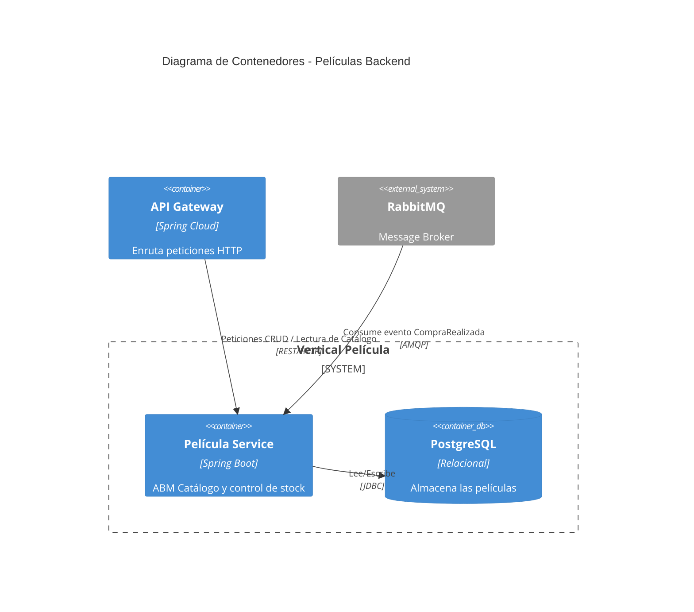

# Película Backend

## Descripción de Propósito
Este vertical gestiona el catálogo de películas de "El Almacén de Películas Online". Permite a los administradores realizar el Alta, Baja y Modificación (ABM) de las películas (RF-12), y permite a los clientes listar el catálogo ordenado y ver el detalle de cada película (RF-1, RF-2). También es responsable de controlar el stock de alquiler/venta (RF-15).

## Servicios que Expone vía HTTP
- `GET /api/peliculas`: Lista el catálogo de películas.
- `GET /api/peliculas/{id}`: Obtiene el detalle de una película.
- `POST /api/peliculas`: Crea una nueva película (solo Admin).
- `PUT /api/peliculas/{id}`: Modifica una película (solo Admin).
- `DELETE /api/peliculas/{id}`: Elimina una película (solo Admin).

## Eventos que Publica o Consume (RabbitMQ)
- **Consume**: Evento `CompraRealizada` para descontar el stock de las películas adquiridas y garantizar la consistencia asíncrona.
- **Publica**: Podría publicar `CatalogoActualizado` (opcional).

## Diagramas C4



---

# Guía Paso a Paso: Crear Instancias de Volúmenes en Docker y Configurar una Nueva Base de Datos

Este documento describe el procedimiento recomendado para crear
correctamente los volúmenes de Docker y desplegar una nueva base de
datos usando **Docker Compose**.

------------------------------------------------------------------------

## 📌 1. Verificar los volúmenes existentes

Antes de crear nuevos volúmenes, revisa los existentes:

``` bash
docker volume ls
```

Si hay volúmenes antiguos que ya no usas, puedes eliminarlos:

``` bash
docker volume rm nombre_del_volumen
```

O eliminar todos los volúmenes no utilizados:

``` bash
docker volume prune
```

------------------------------------------------------------------------

## 📌 2. Reconstruir las imágenes (si cambió el código o Dockerfile)

Siempre que cambies el Dockerfile o el código del proyecto:

``` bash
docker compose build --no-cache
```

------------------------------------------------------------------------

## 📌 3. Levantar los servicios y crear automáticamente los volúmenes

Cuando ejecutes:

``` bash
docker compose up -d
```

Docker creará automáticamente los volúmenes declarados.

Para comprobarlos:

``` bash
docker volume ls
```

------------------------------------------------------------------------

## 📌 4. Ver contenido dentro del volumen (Opcional)

Puedes inspeccionar un volumen:

``` bash
docker volume inspect peliculas-data
```

O abrir un contenedor temporal para explorarlo:

``` bash
docker run -it --rm   -v peliculas-data:/data alpine sh
```

------------------------------------------------------------------------

## 📌 5. Resetear completamente la base de datos

Si quieres recrear la BD desde cero:

1.  Apagas los servicios:

    ``` bash
    docker compose down
    ```

2.  Borras el volumen de la base de datos:

    ``` bash
    docker volume rm peliculas-service_peliculas-data
    ```

    *(El nombre depende del proyecto y prefijo del compose)*

3.  Levantas todo nuevamente:

    ``` bash
    docker compose up -d
    ```

La BD se creará completamente nueva.

------------------------------------------------------------------------

## 📌 6. Logs y validación

Ver logs de la base de datos:

``` bash
docker logs peliculas-db
```

Ver logs del microservicio:

``` bash
docker logs peliculas-app
```


